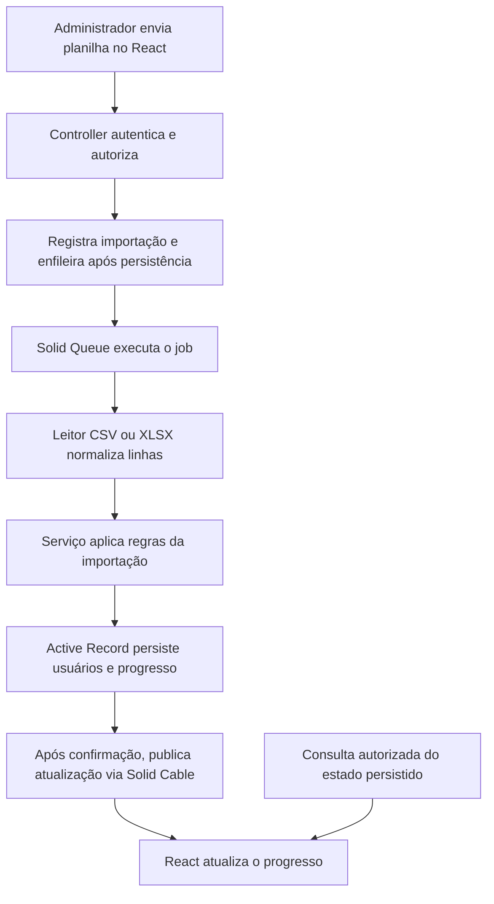

# Arquitetura — ADR-001 aprovada

Data: 2026-09-10. Autor da proposta: Codex. Decisor: Douglas. Estado: aprovada como arquitetura base (D-010).
Pergunta apresentada: "Você concorda com essa arquitetura como base do projeto?"
Resposta de Douglas: "Sim". A aprovação não elimina o planejamento detalhado por entrega nem resolve regras de negócio ainda pendentes.
Base: [leitura do teste](05-LEITURA-DO-TESTE.md), [decisões tecnológicas](07-DECISOES-TECNOLOGICAS.md) e prazo D-003.

## Decisão

Monolito Rails organizado por funcionalidades, baseado em MVC, com React/Inertia na apresentação e serviços de aplicação para orquestrações específicas.

Monolito significa uma aplicação com código e ciclo de entrega conjuntos. O servidor web e o processo de jobs podem executar separadamente usando a mesma aplicação. Organização por funcionalidades significa agrupar responsabilidades de autenticação/acesso, usuários/perfis, importações e painel, preservando as convenções Rails de carregamento e diretórios. A separação será feita por responsabilidades e namespaces quando úteis; não exige adicionar ferramentas de modularização.

MVC separa modelos, apresentação e controladores. Active Record permanece responsável pela persistência e invariantes dos dados; React apresenta as telas e Inertia faz a ligação com os controladores. Classes Ruby específicas podem coordenar operações com várias etapas.

## Responsabilidades

| Parte | O que faz | O que deve ficar em outra parte |
| --- | --- | --- |
| Páginas React/Inertia | Compor telas e conectar os dados recebidos aos componentes | Decisão final sobre autorização e persistência |
| Componentes React | Interação e apresentação reutilizável guiadas pelos tokens | Regras de permissão válidas apenas no navegador |
| Controllers Rails | Receber requisições, autenticar, limitar parâmetros, autorizar e produzir respostas | Leitura e processamento completo da planilha |
| Policies/escopos de autorização | Expressar quem pode executar cada ação sobre quais registros | Detalhes de HTTP, JSX ou leitura de arquivos |
| Models Active Record | Persistência, relações e invariantes dos registros | Orquestração de importação inteira ou construção de respostas para a interface |
| Serviços de aplicação | Coordenar operações com múltiplos passos e transações | Sessão HTTP implícita ou dependência da interface |
| Leitores CSV/XLSX | Converter os formatos em uma representação comum de linhas | Decidir permissões ou criar usuários por conta própria |
| Jobs/Active Job/Solid Queue | Executar operações demoradas, com estratégia explícita de repetição e falha | Depender de controller ou sessão em memória |
| Action Cable/Solid Cable | Transportar atualizações autorizadas para o frontend | Ser a única fonte do estado de uma importação |
| Consultas e dados de apresentação | Consultar totais e expor campos explicitamente permitidos para Inertia | Vazar atributos sensíveis dos modelos |

Policies descreve uma responsabilidade; a escolha entre classes próprias e uma biblioteca específica ainda será justificada no plano. Serviços e consultas adicionais devem existir apenas quando seu papel estiver demonstrado pelo caso de uso, sem criar uma classe intermediária para cada operação simples.

## Exemplo: importar usuários

O progresso persistido permite consultar o estado novamente ao reabrir a tela ou restabelecer a conexão. Canais e consultas exigem autorização. O formato das mensagens e o tratamento de mensagens repetidas ou fora de ordem serão definidos na especificação.

Antes de executar, o plano precisa fechar a estratégia de enfileiramento após commit, os limites transacionais, a prevenção de duplicação em tentativas repetidas, a política para linhas inválidas e a consistência dos contadores. Esses detalhes não estão aprovados por este desenho de alto nível.

## Aplicação de Clean Code e SOLID

- Responsabilidade única: leitura de planilha, autorização, criação de registros e publicação de progresso têm motivos distintos para mudar e devem ter limites claros.
- Aberto/fechado: os dois formatos exigidos podem ter leitores separados sob um contrato comum, evitando misturar condicionais de CSV/XLSX na regra de criação.
- Substituição: ambos os leitores precisam cumprir o mesmo contrato de linhas e erros, verificado por testes de comportamento.
- Interfaces pequenas: o processamento depende das operações necessárias do leitor, sem uma interface genérica de importação com recursos hipotéticos.
- Inversão de dependência onde útil: coordenar a importação por um contrato explícito de leitura, fornecendo o leitor adequado. A persistência continua usando Active Record; não alegar independência total do framework.
- Nomes revelam a finalidade, erros esperados e inesperados têm tratamento distinto e efeitos de gravação/publicação ficam explícitos.

A implementação proposta é MVC com organização por funcionalidades e extrações pontuais. Não a rotular como Clean Architecture estrita: isso exigiria outras regras de dependência e isolamento do domínio que não estão sendo propostas aqui. Clean Code e SOLID são critérios de construção e revisão aplicados a esta arquitetura.

## Limites e validação

Vantagens esperadas: aproveitamento das convenções Rails, entendimento direto dos fluxos e correspondência entre requisitos, testes e código. Custos: o núcleo continua acoplado ao Active Record; as fronteiras lógicas exigem disciplina de revisão; serviços extraídos sem necessidade aumentariam a navegação entre arquivos.

RSpec verificará regras, autorização e integrações; Vitest/React Testing Library verificará comportamento dos componentes; Playwright validará fluxos completos. A aprovação do desenho não comprova o funcionamento: cada entrega precisa da evidência TDD e dos critérios definidos em sua especificação.

Antes de programar, detalhar no plano de cada entrega os arquivos, contratos, dependências, testes, condições de parada e atualização documental. Não criar todas as estruturas hipotéticas antecipadamente.

## Fontes

- [Action Controller e MVC no Rails](https://guides.rubyonrails.org/action_controller_overview.html).
- [Active Job e processamento em segundo plano](https://guides.rubyonrails.org/active_job_basics.html).
- Skill local consultada: `/Users/douglas/.agents/skills/clean-code/SKILL.md`, aplicada ao desenho de responsabilidades. Não há código implementado para atribuir nota de revisão.

A organização proposta e seus limites são decisões de projeto sugeridas pelo assistente, não exigências literais dessas fontes.
