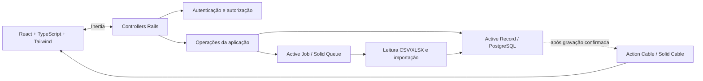

# Mapa do projeto

Estado: desenho aprovado em alto nível; componentes ainda não implementados.

Os detalhes de publicação, contratos e transações serão definidos por entrega. A seta após gravação é uma intenção de fluxo, não um callback global já decidido.

Documentos também se conectam: [[00-PEDIDO-001|Pedido]] → [spec](specs/000-documentation/spec.md) → [plano](specs/000-documentation/plan.md) → [tarefas](specs/000-documentation/tasks.md) → [[PROTOCOL|prompt/EXEC/revisão]].

Relacionados: [[GLOSSARIO]], [[08-ARQUITETURA-PROPOSTA]], [[HOME]].
